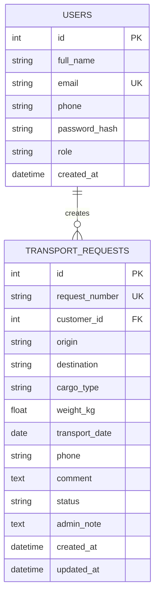

# ER-диаграмма

```mermaid
erDiagram
    USERS ||--o{ TRANSPORT_REQUESTS : creates
    USERS {
        int id PK
        string full_name
        string email UK
        string phone
        string password_hash
        string role
        datetime created_at
    }
    TRANSPORT_REQUESTS {
        int id PK
        string request_number UK
        int customer_id FK
        string origin
        string destination
        string cargo_type
        float weight_kg
        date transport_date
        string phone
        text comment
        string status
        text admin_note
        datetime created_at
        datetime updated_at
    }
```

Бір пайдаланушы бірнеше тасымалдау өтінімін жасай алады. Әр өтінім бір пайдаланушыға тиесілі. Қатынасы: `users.id` → `transport_requests.customer_id` (1:N).
